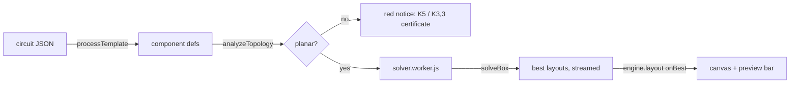

# Layout engine architecture

Technical reference for the box solver and the topology check. For the user-facing explanation see [how-it-works/](how-it-works/README.md); the previous pipeline is described in [legacy-optimizer.md](legacy-optimizer.md).

## Problem model

- Board: unbounded grid of holes. A layout is a placement (position + rotation in 90° steps per part) plus one wire forest per net.
- A part is its pin offsets; its body is the pins' bounding box (`w × h`). Bodies may not overlap.
- Wires move between 4-neighbouring holes. A hole holds at most one net. A wire may not enter a pin of another net (or an unconnected pin), and may not enter the body of a part with `routeUnder: false`. A net may pass through its own pins.
- `routeUnder` defaults to **true** (`processTemplate`): wiring is on the solder side, so only pins block.
- Objective, lexicographic: every net connected, then minimal bounding-box area (bodies + wire cells), then minimal wire length.

## Data flow in the app

`AutorouterEngine.layout(defs, { refine })` (`src/engine/engine.js`) runs the topology check, then `solveBox` in a Web Worker (inline when `Worker` is undefined, e.g. Node). Each new best layout is recentred on the previous layout's centre, written to the engine state and pushed to the UI. Stopping: `engine.cancel()` posts `stop`; the worker also stops on stagnation (no improvement for `max(stallMs, ½ · time of last improvement)`, with `stallMs` = 1.2 s per part clamped to 3–15 s) or after `budgetMs` = 60 s (`engine.layoutConfig`). The stall constants were calibrated by replaying the recorded benchmark traces: score 1.017 vs 1.006 for the full minute, ~19 s average run time. `refine: true` passes the current components as `initial`.

## `src/engine/topology.js`: unroutability proof

Builds graph Q: one vertex per net with ≥ 2 pins; every blocking cell of a part (pins, plus all body cells if `routeUnder` is false) is a vertex with its grid adjacencies; every pin is identified with its net's vertex. Contracting each net's copper (wires + its pins, a connected set) in any valid layout yields a planar drawing of Q, so Q non-planar ⇒ unroutable for every placement and board size.

- `isPlanar(n, edges)`: biconnected blocks (iterative Tarjan) + Demoucron–Malgrange–Pertuiset path addition per block. Cross-checked against NetworkX `check_planarity` on 3000 random graphs, zero mismatches.
- `kuratowskiSubgraph`: greedy edge deletion to a minimal non-planar subgraph; branch vertices give K5 vs K3,3.
- `analyzeTopology(defs)` → `{ planar, walls, certificate?: { type, parts, nets, branch }, explanation? }`.

Not sufficient for routability: it ignores capacity (e.g. the 2-hole corridor of a DIP), and the constraint that two walls must not cross at a shared net vertex. A planar circuit can still be unroutable; `bench/circuits/06_motor_l293d` is the known example.

## `src/engine/solver/`

### `model.js`

`buildModel(defs)`: numeric nets, per part 4 precomputed rotations (`w, h, dc[], dr[]`, same convention as `rotateComp90InPlace`), `routedNets` (≥ 2 pins), total body area. `toEngine(model, pl, routing, W)` converts back to engine components (via `makeComp` + rotation) and wires (`{ net, path, failed: false }`).

A placement `pl` is `{ ox, oy, rot }` as typed arrays indexed by part.

### `boxrouter.js`: negotiated-congestion router in a W×H box

- `setPlacement(pl)` rasterises bodies and pins (`pinNet`: net id, `CELL_FREE` or `CELL_DEAD` for unconnected/colliding pins) and returns the overlap count (out-of-box cells count 4 each).
- `routeNet(n, occ, pres, seed)`: Steiner tree by repeated multi-source/multi-target A* from the current tree to the remaining pins. Step cost `1 + hist + pres · occ(other nets) + turnCost` (0.2 per bend). Returns `{ conns, cells, missing }`; `cells` are the non-pin wire cells used for occupancy.
- `negotiate({ state, maxIter, pres0, presMul, histInc, partial })`: PathFinder loop. With a warm `state`, nets whose old tree is still intact (`salvage().intact`) are kept untouched; damaged nets regrow from their salvage. Each round re-routes only nets on overused cells; present cost × `presMul` per round, history cost += `histInc` on overused cells. Returns `{ conns, cells, missing, occ, overuse, miss, wl, badNets }`.
- `salvage(n, conns, occ?)`: drops connections that cross a now-illegal cell (or, during negotiation, a cell another net uses) or no longer end on an own pin; keeps the connected piece touching the most pins. This partial repair is the main speed lever.
- Jumpers (`jumpCost > 0`): from a free hole with no body on it, A* may step 2..`jumpMax`+1 holes in a straight line over holes without bodies/pins, cost `jumpCost + length`. A jump is stored as a non-adjacent step inside a connection; `jumpSpan`/`isJump` decode it. Component-side coverage (`jocc`) is negotiated like `occ` and folded into `overuse`; `salvage` drops jumps that a part now covers. `toEngine` emits each jump as its own wire `{ jumper: true, path: [a, b] }`.
- `trim()` (during search) cuts dangling non-pin ends; `prune()` (on output) rebuilds each net as a clean tree: BFS spanning forest over the copper, leaf trimming, split into paths between pins/junctions. Salvage can otherwise leave loops.

Profile (MOSFET bank, 23 parts): A* in `routeNet` ≈ 60 % of runtime.

### `boxsolver.js`: `solveBox(defs, opts)`

Cost of a state: `6 · overlap + 10 · missing pins + 2 · overused cells + 0.02 · wire length + jumperWeight · jumpers`. Legal ⇔ the first three are zero. Best layouts are compared by `area + jumperArea · jumpers` (default 4), then wire length.

Jumper policy: `V.jumpers: 1` allows them from the start, `V.jumperAfterMs` switches them on if no legal layout exists by then. `engine.layout` uses `jumpers: 1` for non-planar circuits and `jumperAfterMs: 10000` otherwise (`bench` strategy `app` mirrors this).

1. **Start.** Square box of side `≈ √(3 · body area)` (or `√(1.6 · best area)` on restarts). Random placement, then `hpwlPlace`: a fast anneal on half-perimeter wire length with a 1-hole keep-out around bodies, no routing. With `opts.initial` (Refine), the first attempt uses the given layout in its bounding box + 1 hole margin instead.
2. **Anneal to legality** (`anneal`): Metropolis with geometric cooling (`T0` → `T1`). The acceptance threshold `-T · ln(u)` is drawn first; a move whose overlap lower bound already exceeds it is rejected without routing (exact, saves 20–35 % of evaluations). Returns at the first legal state.
3. **Crop** to the real footprint (`crop`, remaps the routing), record the best layout (with `prune`d trees).
4. **Shrink**: for W−1 or H−1 (larger area cut first), try `lines` random rows/columns, remove the one with the lowest resulting cost (`removeLine`: parts beyond it shift by one, the rest is clamped), anneal with effort `effort · nParts · (1 + fails)`. On failure try the other axis; after `fails` consecutive failures, restart.
5. Near-misses (no overlap, no missing pin, ≤ `polish` overused cells) get a cold re-route with `polishIter` rounds before being judged.

Moves (`propose`, weights in `V`): shift ±1/±2, rotate (about the centre), swap two parts' centres, random jump, **smart jump** (move the part so one of its pins lands next to another pin of the same net, rotation randomised half the time), push (off). Parts involved in a violation are chosen with probability `pViol`; with `local: 1` "involved" means within `radius` of an overused cell rather than on a conflicting net.

All tunables live in the `V` object at the top of `solveBox` and can be overridden per call (`opts.variant`) or per benchmark run (`--opt key=val,...`). Current defaults came out of the quick benchmark; the table of what helped is in [how-it-works/05-measuring-progress.md](how-it-works/05-measuring-progress.md).

Determinism: the solver uses `Math.random`; the benchmark seeds it. Runs with the same seed still diverge slightly because budgets are wall-clock.

### `solver.worker.js`

Message protocol: in `{ type: 'solve', defs, initial, budgetMs, stallMs }` / `{ type: 'stop' }`; out `{ type: 'best', components, wires, metrics }`, `{ type: 'progress', elapsed, text }`, `{ type: 'done', found }`.

## Benchmark (`bench/`)

See the Commands section of the repository's `CLAUDE.md`. Key points: 14 circuits (`make-circuits.js` generates 04+ and the `x*` (un)routability cases), parallel worker processes with seeded `Math.random`, independent `validate.js`, score = geometric mean of area / frozen `reference.json` (unrouted = 2), quick mode on three hard boards for iteration. Reference runs: `bench/baselines/`.

## Legacy code still in use

The UI's manual tools still use the old modules: `router.js` (`route`, `incrementalReroute`) for Connect, manual wires and repairs after edits; `grid.js`; `placer.js` geometry helpers; `scoreState` / `recenterComponents` from `optimizer-algorithms.js`. The old optimisation pipeline (`optimizer.js`, the passes in `optimizer-algorithms.js`, `engine.placeAndRoute/optimize/plateau`) is no longer reachable from the UI. Only `bench/strategies.js` → `legacy` still runs it, for comparison; it can be removed once that isn't needed.
